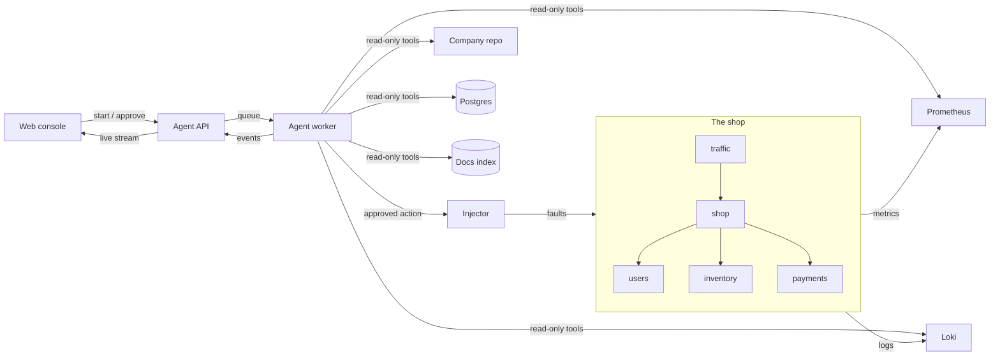

# IncidentPilot

An AI agent that investigates incidents in a running system, finds the root cause with
evidence and proposes a fix. Nothing is changed until a person approves it; after the
fix, it checks that the system has actually recovered.

It runs against a small online shop built for the purpose: four microservices with
real traffic, logs and metrics. Faults are injected for real (a deploy with a bug, a
bad config change, a database lock, a provider going slow), so every incident has a
known right answer to grade the agent against.

**[Try the demo](https://incilot.vercel.app)** ·
[Open in Codespaces](https://codespaces.new/antoniolorenz01/Incilot) ·
[Run it locally](#run-it-locally)

The demo replays real investigations recorded from the agent: you pick a fault, watch
the agent work and take the decision yourself. To run the agent live, use Codespaces
or your own machine.

## How an incident goes

1. **Something breaks.** The injector applies a fault to the shop and adds a few
   harmless commits around it as decoys. Customers start to notice: orders fail or
   slow down.
2. **The agent investigates.** It starts from a summary of what changed (no AI
   involved) and then decides, step by step, what to look at: metrics, logs, recent
   commits, the code and config, the runbooks and the database. All its tools are
   read-only.
3. **A person decides.** The agent stops with a diagnosis: the cause, the evidence and
   one proposed action (roll back a commit, revert a config change, restart a service,
   end a blocking database session, or escalate to an external provider). It can be
   approved, amended or rejected.
4. **The fix is applied and checked.** Only the approved action runs. A minute later
   the shop's error rate and response times are measured again to confirm it recovered.

## Results

Each fault in the catalogue (13 types, 23 variants) is injected, investigated and
graded against the injector's record of what really happened. A diagnosis counts as
right when the proposed action would actually fix the incident.

| Model | Right action | Right service | Right commit | Decoy commit blamed |
|---|---|---|---|---|
| Claude Sonnet (via Claude Code) | 23 / 23 | 23 / 23 | 23 / 23 | 0 |

`make eval` runs the catalogue and prints this table, per difficulty and per split
(`dev` variants were used while building the agent, `exam` variants were held back).

## How it's built



| Part | Built with |
|---|---|
| The shop and the injector | Python, FastAPI, Postgres, Redis, Docker Compose |
| Observability | Prometheus, Loki, Alloy, Grafana |
| The agent | LangGraph, OpenAI or Claude, pgvector, Postgres checkpoints |
| Agent API | FastAPI, a Redis queue, Redis Streams and Server-Sent Events |
| Web console | Next.js, React, Tailwind |
| Evals | Fault catalogue with ground truth, run end to end |

## Design decisions

- **A person approves every change.** The model has no tool that modifies anything.
  The graph pauses before acting and only executes the approved action, through a
  separate connector with its own credentials.
- **The agent runs with least privilege.** Its container has read-only access to the
  repo and runbooks, a database user that can only read, no Docker socket and no
  access to the injector or the ground truth.
- **The environment is not easy on purpose.** Decoy commits land around the culprit,
  and background noise (transient errors, spikes) runs all the time, so "blame the last
  commit" or "blame the first error" does not work.
- **Triage first, without a model.** Before the agent starts, each key metric is
  compared with its baseline and log errors are grouped and marked as new, growing or
  stable. The agent starts knowing where to look, which saves steps and tokens.
- **Measured, not guessed.** The agent is graded against ground truth, and the
  document search was chosen by measuring recall and ranking on a set of questions
  (`make rag-eval`) rather than by default.
- **It survives restarts.** Investigation state is checkpointed in Postgres: an
  investigation can wait hours for a decision and resume exactly where it stopped.
  The live stream resumes from the last event the browser saw.
- **Bounded cost.** Each investigation has a step and token budget, tool output is
  trimmed to fit each round, and logs reach the model grouped by pattern instead of
  line by line.
- **Not tied to one provider.** The agent runs on OpenAI with a fallback model, or on
  Claude through Claude Code for local runs.

## Problems found along the way

Running the full catalogue end to end surfaced issues that unit tests would not have:

- **Incidents leaked into each other.** With incidents back to back, the previous
  one's errors were still in the triage window and looked new, and the agent
  diagnosed a network fault. The alert now carries the exact start time and triage
  compares from that moment.
- **The agent depended on what was breaking.** Its job queue lived in the shop's Redis,
  so the "Redis down" fault stopped the investigation from starting. The agent now has
  its own Redis.
- **Big incidents broke the triage.** With a service down, thousands of error lines a
  minute made the log query time out and end the investigation. The query has more
  time, and a failing source now becomes a note for the agent instead of an error.
- **A right answer failed to apply.** The agent once wrote a commit as
  `config/users.env (commit 5eb28d2)` instead of the bare SHA; the action was right but
  could not be executed. The executor now finds the SHA in the text.

## Limitations

- The shop is small and the faults come from a known catalogue; a real system has more
  services, more kinds of failure and messier signals.
- One incident at a time, with a single root cause.
- Logs and commits are untrusted input: defending the agent against instructions
  hidden in them (prompt injection) is the next piece of work.
- The live demo needs a server; the public demo replays recorded runs instead.

## Run it locally

Requirements: [uv](https://docs.astral.sh/uv/), Docker with the compose plugin, Node 24
and `make`. The synthetic data lives in a second repository, next to this one:

```bash
git clone https://github.com/antoniolorenz01/Incilot
git clone https://github.com/antoniolorenz01/incilot-data
cd Incilot
echo "OPENAI_API_KEY=sk-..." >> .env    # optional: dry runs need no key
echo "OPENAI_MODEL=gpt-6-luna" >> .env
make install && (cd web && npm ci)
make up      # the shop, observability and the agent (about 2 GB of RAM)
make web     # the console at http://localhost:3001
```

With a Claude subscription instead of an OpenAI key, the agent can run on Claude Code:
set `LLM_PROVIDER=claude-code` in `.env` and keep `make claude-bridge` running in
another terminal.

To give someone temporary access from your machine, start the console with the demo's
limits on and open a public tunnel (free, no account needed):

```bash
DEMO_LIMITS=on make web
cloudflared tunnel --url http://localhost:3001
```

Deploying the recorded demo (free, on Vercel) or the live one (on a server) is
described in [infra/deploy.md](infra/deploy.md).

## Repository layout

```
sim/          The shop (microservices, traffic, logs, metrics) and the fault injector
agent/        The agent: tools, document search, API and worker
evals/        Runs the catalogue, grades the agent and records demo runs
web/          The web console (Next.js)
docs/         The shop's own documentation, which the agent searches
infra/        Postgres, Prometheus, Loki/Alloy, Grafana, Caddy and the deploy guide
compose.yaml  The whole environment; compose.prod.yaml adds the public setup
```

The synthetic data (the company's Git history, the fault catalogue with its ground
truth and the runbooks) lives in [incilot-data](https://github.com/antoniolorenz01/incilot-data).

## Development

```bash
make check         # lint and tests
make fmt           # auto-format
make up / down     # start or stop everything (make clean also deletes the data)
make logs          # follow the logs
make smoke         # inject each fault, check its symptom shows up, recover
make investigate   # run the agent against whatever is happening right now
make eval          # run the catalogue and grade the agent (one investigation per variant)
make rag-eval      # measure the document search configurations
make record        # record investigations for the demo
make web           # the console at http://localhost:3001
```

## The shop

| Service | What it does | Data |
|---|---|---|
| `shop` | Customer entry point: catalogue and orders; orchestrates the rest | Postgres + Redis |
| `users` | User profiles | Postgres + Redis |
| `inventory` | Catalogue, stock and reservations (restocks every 30 s) | Postgres |
| `payments` | Charges against a simulated provider (about 3 % declined) | Postgres |
| `traffic` | Virtual shoppers that buy non-stop | — |

An order: `shop` checks the user, looks up the product, reserves stock, charges and
confirms. If the charge fails, the reservation is released. Every service logs JSON
with a `request_id` that travels between services and exposes metrics on `/metrics`.

| Tool | URL | What for |
|---|---|---|
| Shop | http://localhost:8000/docs | The shop's API |
| Injector | http://localhost:8100/docs | Inject and recover faults |
| Agent | http://localhost:8200/docs | Start, follow and approve investigations |
| Prometheus | http://localhost:9090 | Metrics |
| Loki | http://localhost:3100 | Logs (`{service="shop"}`) |
| Grafana | http://localhost:3000 | Explore metrics and logs |
